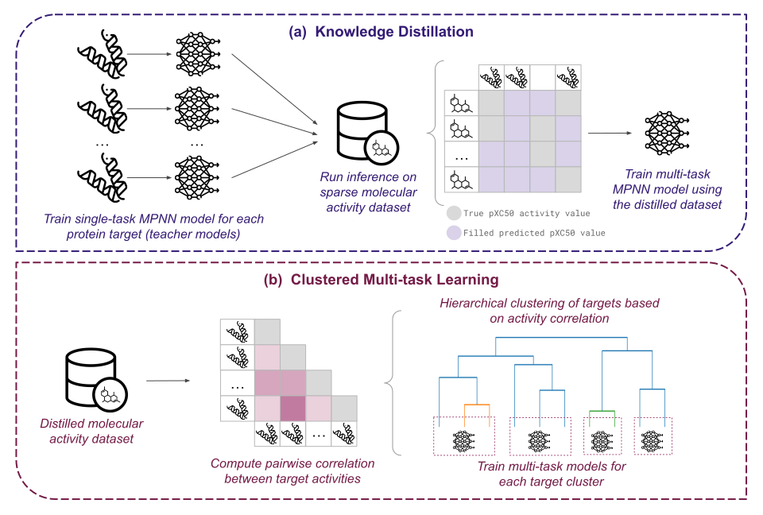

# Multitask-learning and Knowledge Distillation for Graph Neural Networks

This repository contains the code and data for the paper "Enhancing Graph Neural Networks for Multi-Target Activity Prediction Through Multi-Task Learning and Knowledge Distillation".

<figure>
    
</figure>

## Setup

To reproduce this work results, you must have git and python (with pip) installed on your machine. 

First, use git to clone the repository.

```bash
$ git clone https://github.com/arthurcerveira/GNN-MTL-Distilled.git
$ cd GNN-MTL-Distilled/
```

Then create a virtual environment from the `environment.yml` file and install the dependencies.

```bash
$ conda env create -f environment.yml
$ conda activate gnn
$ pip install -r requirements.txt
```

## Data 

The datasets for training and testing the baselines are available [here](https://github.com/arthurcerveira/GNN-MTL-Distilled/releases/tag/v1.0.0). These datasets must be stored in the `data` directory.

Optionally, if you have the ExCAPE-DB dataset stored in the `data` directory, you can run the following scripts to create the datasets for training and testing the baselines.

```bash
$ python preprocess/construct_dataset.py
$ python preprocess/split_lohi.py
```

Then, you need to run the notebooks in the `clustering` directory to create the target clusters and the distilled datasets.

## Instructions

With the environment activated and the data stored in the `data` directory, you can run the following script to reproduce the results.

```bash
$ bash run.sh
```

This scripts will train the baselines for each dataset, and then assess the trained models on each scenario. The results will be stored in the `results` directory.

